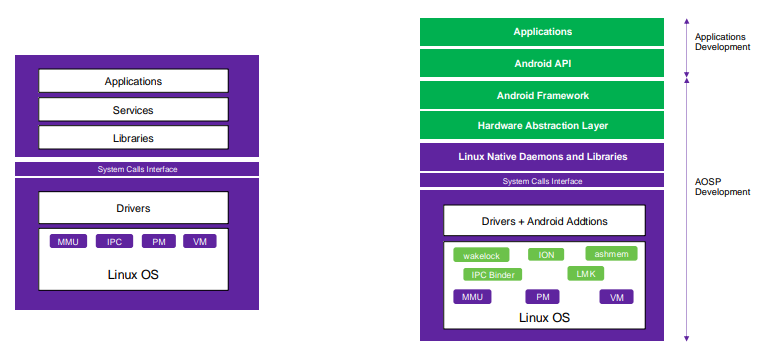

# Android Automotive OS

## Table of Contents

- [Android Automotive OS](#android-automotive-os)
  - [Table of Contents](#table-of-contents)
  - [What is Android Platform?](#what-is-android-platform)
  - [Why Android?](#why-android)
  - [Android vs Linux](#android-vs-linux)

## What is Android Platform?

- Android is a mobile **operating system** developed by Google
- It is initially designed for smartphones and tablets.
- It's based on the **Linux kernel** and is **open-source**, which allows manufacturers to **customize** it for various devices..
- Strong **developer** community have made Android a dominant platform across various industries, making it integral to many aspects of modern technology.

## Why Android?

- **`Full Stack`**:
  - It  covers the entire **product stack**, from the operating system to the application layer.
  - Offering flexibility to transform hardware into functional devices thanks to its open-source nature.
- **`Broad Acceptance`**:
  - Running on most chipsets and hardware with many SoC vendors providing reference kits.
  - Its popularity ensures a large pool of skilled developers for all layers of the OS.
- **`Linux-Based`**:
  - Officially supports ARM and Intel processors and highly optimized for them. While Linux drivers and community support ease hardware integration, Android's build systems are optimized for specific architectures.  This optimization ensures that the operating system runs efficiently on these architectures, taking full advantage of their capabilities.
- **`Powerful Development Environment`**:
  - Android's toolchains are robust, with ongoing improvements.
  - The system uses Soong, alongside GNU make, for faster builds.
    - **Soong**:
      - Modern build system used primarily for building Android's platform source code (AOSP).
      - It was introduced to replace the older Gradle-based build system used in earlier Android versions.
      - It is optimized for parallel execution, resulting in faster builds.
      - It is written in Go, which makes it easier to maintain and extend.
    - **GNU make**:
      - It handles tasks that are **not yet migrated to Soong**, such as some lower-level components, device-specific configurations, or legacy modules and kernel.
    - **`The Android build system uses a hybrid approach`**
      - When you initiate a build using the make command, it first invokes Make, which in turn calls Soong for the modules defined in .bp files.
      - This means that Make acts as a wrapper around Soong, orchestrating the build process and ensuring that both Soong and Make modules are built correctly in the right order.
- **`Open Source`**:
  - Android is open-source, which allows manufacturers to customize it for various devices.

## Android vs Linux

- Android is a framework **built on top of the Linux kernel**. So every Android device is running the Linux kernel underneath.
- Both Linux and Android are **open-source** operating systems.
- Android is **based on the Linux kernel**, which means that it shares many of the same features and capabilities as Linux.
- Both are **Highly customizable** and has a large community of developers and software repositories.
- **Security**:
    1. **User Access Control:**
        - **Linux**: Multi-user system with root access and Discretionary Access Control (DAC).
        - **Android**: Single-user system; treats each app as its own user (UID) with sandboxing. No default root access.
    2. **Application Security:**
        - **Linux**: Apps installed via package managers with user-controlled permissions.
        - **Android**: Apps distributed via Google Play Store, use of runtime permissions for sensitive data.
    3. **Security Features:**
        - **Linux**: Optional SELinux, firewalls (`iptables`), disk encryption.
        - **Android**: Enforced SELinux, Verified Boot, File-Based Encryption, Google SafetyNet.
    4. **Security Updates:**
        - **Linux**: Frequent manual updates by users.
        - **Android**: Monthly patches from Google, slower due to OEMs.
- **`C Library`**: Unlike Linux, which uses the `glibc C` library, Android uses a different C library called `Bionic` (developed by Google). `Bionic` is designed to consume **less memory and CPU**, making it more efficient for mobile devices.
- **`Scheduler`**:
  - The Linux and Android kernels use nearly the same scheduler, **the Completely Fair Scheduler (CFS).** However, Android has a few modifications to the CFS to improve performance on mobile devices.
  - Android uses a **wake lock mechanism** to prevent the system from entering deep sleep when an app requires continuous processing.
- **`Inter-process Communication`**:
  - Google implemented its own inter-process communication system called **Binder IPC**, replacing the traditional System V IPC used in Linux.
    - **No Global Namespaces:** Android apps run in their own sandboxed environment, with no global namespaces. This means that apps cannot access each other's memory space.
        **Communication via Binder IPC in Android:**
        1. **Sending a Request**: The app sends a **method call** request to the **Binder driver** within the Android kernel.
        2. **Binder Driver as a Middleman**: The **Binder driver** acts as an intermediary, securely transferring the request between two isolated processes.
        3. **Processing the Request**: The receiving process handles the request, performs the necessary operations, and processes the data.
        4. **Sending a Response**: After processing, the receiving process sends a **response** back through the Binder driver.
        5. **Returning the Binder Object**: The     Binder driver returns the response (as a Binder object) to the calling process.
        6. **Accessing the Response**: The calling process can now access the response without having direct access to the other process’s memory.
- **`Low Memory Killer`** or **`OOM Killer`** is responsible for terminating unused or low-priority applications to free up resources and manage memory more efficiently.
- **`Special Logging System`**: Similarly, in Android, dmesg is used for kernel logs, but logcat is used for logging application and system services.
- **`HAL`**: manages exclusive access to hardware resources, such as the camera, Bluetooth modules, and Wi-Fi, ensuring smooth interaction with the hardware components.
- **`Power Management`**: Android has its own power management system, which is more advanced than the one in the Linux kernel. It includes features like **wakelocks**, **suspend mode**, and **battery optimization**.

